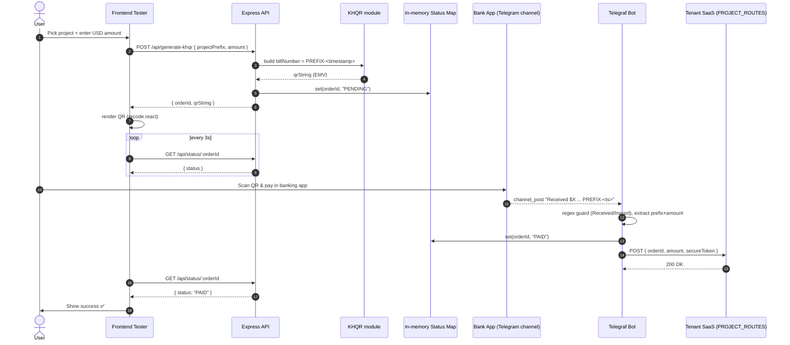
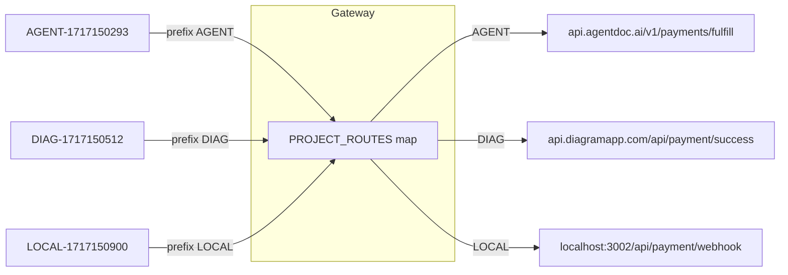
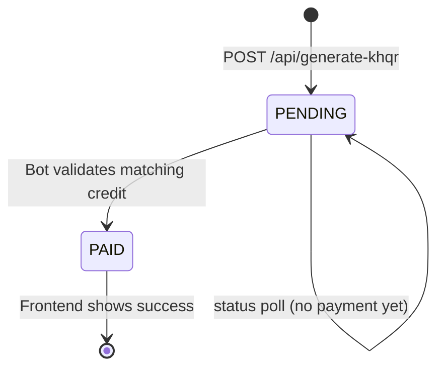

# API Workflow — Central KHQR Payment Microservice

How a payment moves through the gateway, from QR generation to tenant fulfillment.

---

## 1. Components

| Component | Role |
|-----------|------|
| **Frontend Tester** (`PaymentTester.tsx`) | Generates QR, polls status. |
| **Express API** (`server.ts`) | Stateless KHQR generation + in-memory status store. |
| **KHQR module** (`khqr.ts`) | Builds EMV-compliant QR string via `bakong-khqr`. |
| **Telegram bot** (`telegram.ts`) | Listens to bank channel posts, validates credits, dispatches webhooks. |
| **PROJECT_ROUTES** (`config.ts`) | Multi-tenant prefix → target webhook URL map. |
| **Tenant SaaS apps** | AGENT / DIAG / LOCAL — receive the fulfillment POST. |

---

## 2. End-to-end sequence



---

## 3. Bot validation decision flow

```mermaid
flowchart TD
    A[channel_post received] --> B{matches /Received|Inward/i ?}
    B -- No --> X[Ignore: debit / system log]
    B -- Yes --> C{matches /[A-Z]+-\d+/ ?}
    C -- No --> X
    C -- Yes --> D[Extract prefix + orderId]
    D --> E{amount after '$' parsed ?}
    E -- No --> X
    E -- Yes --> F{PROJECT_ROUTES has prefix ?}
    F -- No --> X
    F -- Yes --> G[Status Map: orderId = PAID]
    G --> H[POST tenant URL\n orderId, amount, secureToken]
    H --> I{2xx response ?}
    I -- Yes --> J[Done ✅]
    I -- No --> K[Log delivery failure]
```

---

## 4. Multi-tenant routing



---

## 5. Endpoint reference

### `POST /api/generate-khqr`
**Request**
```json
{ "projectPrefix": "AGENT", "amount": 1.50 }
```
**Response `200`**
```json
{ "orderId": "AGENT-1717150293", "qrString": "00020101021229..." }
```
**Errors:** `400` invalid prefix or non-positive amount.

### `GET /api/status/:orderId`
**Response `200`**
```json
{ "orderId": "AGENT-1717150293", "status": "PENDING" }
```
`status` ∈ `PENDING | PAID`. Unknown orderId → `404`.

### Webhook dispatched to tenant (outbound)
```json
{ "orderId": "AGENT-1717150293", "amount": 1.50, "secureToken": "<SHARED_WEBHOOK_SECRET>" }
```
Tenant must verify `secureToken` equals its shared secret before fulfilling.

---

## 6. Lifecycle states



---

## 7. Why this is database-less & reusable
- **No DB:** order state lives in a single `Map<string,'PENDING'|'PAID'>`, cleared on restart. Acceptable because each payment is short-lived (QR expiry minutes) and the source of truth is the tenant after webhook delivery.
- **Reusable:** new project = one line in `PROJECT_ROUTES`. The `orderId` prefix carries tenant identity end-to-end, so the same gateway and bot serve every team app without code changes.
