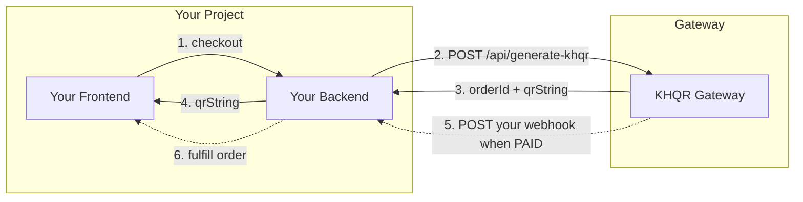
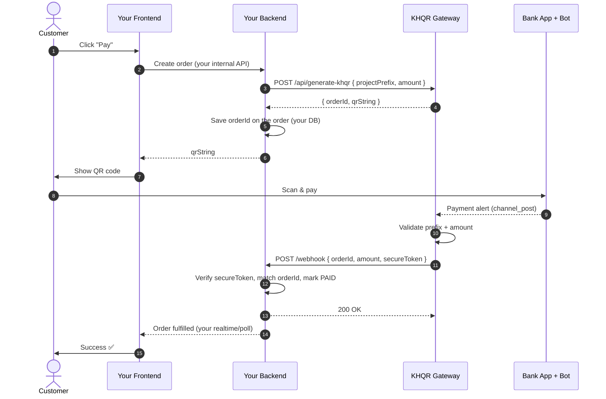
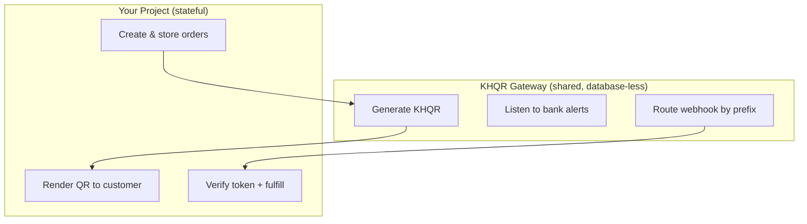

# System Workflow — Integrating Your Project with the KHQR Gateway

Audience: a **client project backend** (e.g. your teammate's SaaS app) that wants to accept Bakong payments through the central gateway.

This is a **backend-to-backend** integration. Your server talks to the gateway server; the gateway calls your server back when money arrives.

---

## 1. What you provide (one-time setup)

| You give the gateway team | Example | Where it lives |
|---------------------------|---------|----------------|
| A **project prefix** (uppercase code) | `AGENT` | added to `PROJECT_ROUTES` in gateway `config.ts` |
| Your **fulfillment webhook URL** | `https://api.yourapp.com/api/payment/webhook` | the value mapped to your prefix |
| You both share a **secret token** | `SHARED_WEBHOOK_SECRET` | gateway `.env` + your backend env |

> Adding your project = **one line** in the gateway:
> ```ts
> const PROJECT_ROUTES = { ..., YOURAPP: 'https://api.yourapp.com/api/payment/webhook' };
> ```

---

## 2. The two integration points



- **Outbound (you → gateway):** ask for a QR.
- **Inbound (gateway → you):** receive confirmation when the customer pays.

---

## 3. Step 1 — Request a QR (your backend → gateway)

**Call:**
```
POST https://gateway.yourteam.com/api/generate-khqr
Content-Type: application/json
```

**What you send:**
```json
{
  "projectPrefix": "YOURAPP",
  "amount": 1.50
}
```

| Field | Type | Notes |
|-------|------|-------|
| `projectPrefix` | string | Your assigned uppercase code. Must exist in `PROJECT_ROUTES`. |
| `amount` | number | USD, positive. |

**What you get back (`200`):**
```json
{
  "orderId": "YOURAPP-1717150293",
  "qrString": "00020101021229..."
}
```

| Field | Type | Notes |
|-------|------|-------|
| `orderId` | string | `PREFIX-<timestamp>`. **Store this** — it's how you match the webhook later. |
| `qrString` | string | EMV payload. Render it as a QR image for your customer. |

**Errors:** `400` if `projectPrefix` is unknown or `amount` ≤ 0.

> Your backend persists `orderId` against the customer's order in **your own** database (the gateway stays database-less).

---

## 4. Step 2 — Customer pays

Customer scans the QR in any Cambodian banking app and pays. The bank broadcasts a text alert (Telegram channel) which the gateway bot reads. No action needed from your side.

---

## 5. Step 3 — Gateway calls your webhook (gateway → your backend)

When the bot validates a matching credit, the gateway sends:

**Call your backend receives:**
```
POST https://api.yourapp.com/api/payment/webhook
Content-Type: application/json
```

**Payload you must expect:**
```json
{
  "orderId": "YOURAPP-1717150293",
  "amount": 1.50,
  "secureToken": "<SHARED_WEBHOOK_SECRET>"
}
```

| Field | Type | What to do |
|-------|------|------------|
| `orderId` | string | Look up the order in your DB. |
| `amount` | number | Verify it matches the expected amount. |
| `secureToken` | string | **Reject the request if this ≠ your shared secret.** |

**What your backend must respond:**
```
200 OK
```
Return `2xx` after you mark the order paid. Non-2xx is logged as a delivery failure by the gateway.

### Minimal handler you implement on your side
```ts
app.post('/api/payment/webhook', (req, res) => {
  const { orderId, amount, secureToken } = req.body;
  if (secureToken !== process.env.SHARED_WEBHOOK_SECRET) {
    return res.status(401).json({ error: 'invalid token' });
  }
  // 1. find order by orderId  2. confirm amount  3. mark paid + fulfill
  return res.json({ ok: true });
});
```

---

## 6. Full backend-to-backend sequence



---

## 7. Responsibility split



| Concern | Owner |
|---------|-------|
| KHQR string generation | Gateway |
| Reading bank/Telegram alerts | Gateway |
| Routing payment to the right project | Gateway |
| Storing orders / customers | **Your backend** |
| Verifying `secureToken` | **Your backend** |
| Fulfilling the purchase | **Your backend** |

---

## 8. Integration checklist

- [ ] Pick a unique uppercase `projectPrefix`.
- [ ] Expose a public `POST /webhook` endpoint on your backend.
- [ ] Share `SHARED_WEBHOOK_SECRET` with the gateway team; store it in your env.
- [ ] Gateway team adds `PREFIX: 'your-webhook-url'` to `PROJECT_ROUTES`.
- [ ] On checkout: call `POST /api/generate-khqr`, save the returned `orderId`.
- [ ] On webhook: verify `secureToken`, match `orderId`, confirm `amount`, fulfill.
- [ ] Always respond `2xx` once handled.
